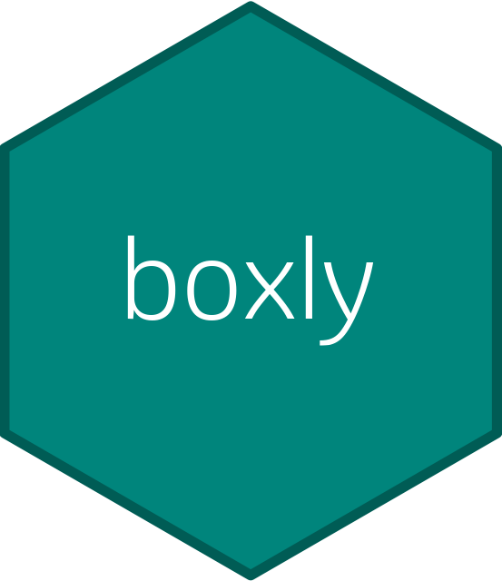

# boxly 

<!-- badges: start -->
[](https://github.com/Merck/boxly/actions/workflows/R-CMD-check.yaml)
[](https://app.codecov.io/gh/Merck/boxly?branch=main)
[](https://cran.r-project.org/package=boxly)
[](https://cran.r-project.org/package=boxly)
<!-- badges: end -->

## Installation

The easiest way to get boxly is to install from CRAN:

```r
install.packages("boxly")
```

Alternatively, to use a new feature or get a bug fix,
you can install the development version of boxly from GitHub:

```r
# install.packages("remotes")
remotes::install_github("Merck/boxly")
```

## Overview

The boxly package creates interactive box plots for clinical trial analysis & reporting.

<video src="https://user-images.githubusercontent.com/85646030/242961824-13439ec6-afa8-43c2-8257-22b1de3d80a0.mp4" data-canonical-src="https://user-images.githubusercontent.com/85646030/242961824-13439ec6-afa8-43c2-8257-22b1de3d80a0.mp4" controls="controls" muted="muted" class="d-block rounded-bottom-2 width-fit" style="max-height:640px;max-width:66%">

</video>

We assume ADaM datasets are ready for analysis and
leverage [metalite](https://merck.github.io/metalite/) data structure to define
inputs and outputs.

## Workflow

The general workflow is:

1. Use the metalite package to construct input metadata from ADaM datasets.
1. Use `prepare_boxly()` to prepare datasets for interactive box plot.
1. Use `boxly()` to generate an interactive box plot.

Here is a quick example using an example dataset:

```r
library("boxly")

analysis_plan <- metalite::plan(
  analysis = "boxly",
  population = "apat",
  observation = "wk12",
  parameter = "SODIUM"
)

meta <- metalite::meta_adam(
  population = boxly_adsl,
  observation = boxly_adlb
) |>
  metalite::define_plan(analysis_plan) |>
  metalite::define_population(
    name = "apat",
    group = "TRTA",
    subset = SAFFL == "Y",
    label = "Safety Population"
  ) |>
  metalite::define_observation(
    name = "wk12",
    group = "TRTA",
    var = "PARAM",
    subset = AVISITN <= 12 & !is.na(CHG),
    label = "Weeks 0 to 12"
  ) |>
  metalite::define_parameter(
    name = "SODIUM",
    label = "Sodium (mmol/L)",
    subset = PARAMCD == "SODIUM"
  ) |>
  metalite::define_analysis(
    name = "boxly",
    label = "Interactive Box Plot",
    x = "AVISITN",
    y = "CHG"
  ) |>
  metalite::meta_build()

meta |>
  prepare_boxly() |>
  boxly()
```

## Highlighted features

- Parameter selection: Drop-down menu to select parameter of interest.
- Interactivity: Display summary statistics and outlier information interactively.
- Listing: Provide detailed information in interactive listing.
